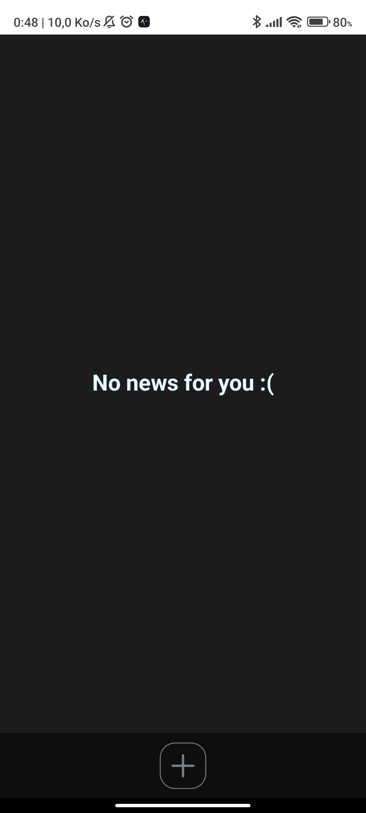
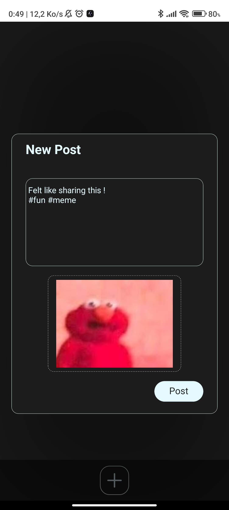
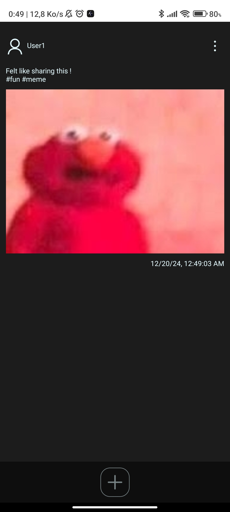
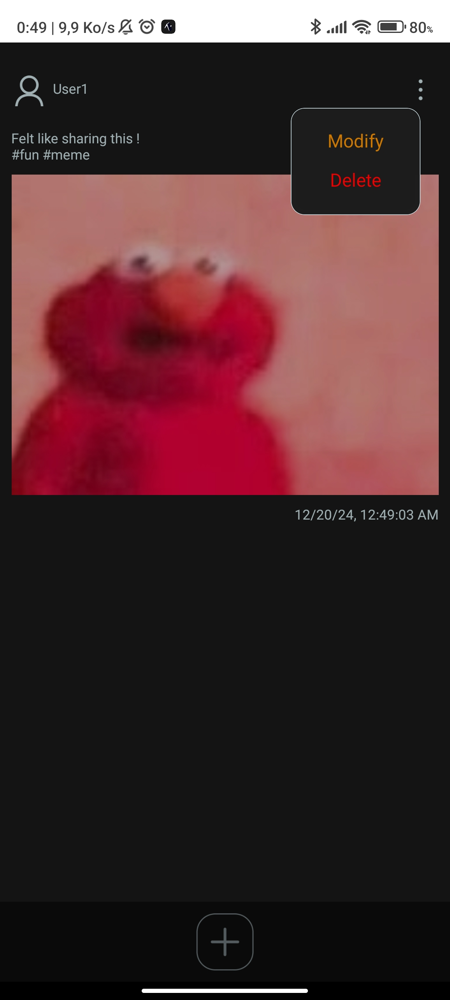
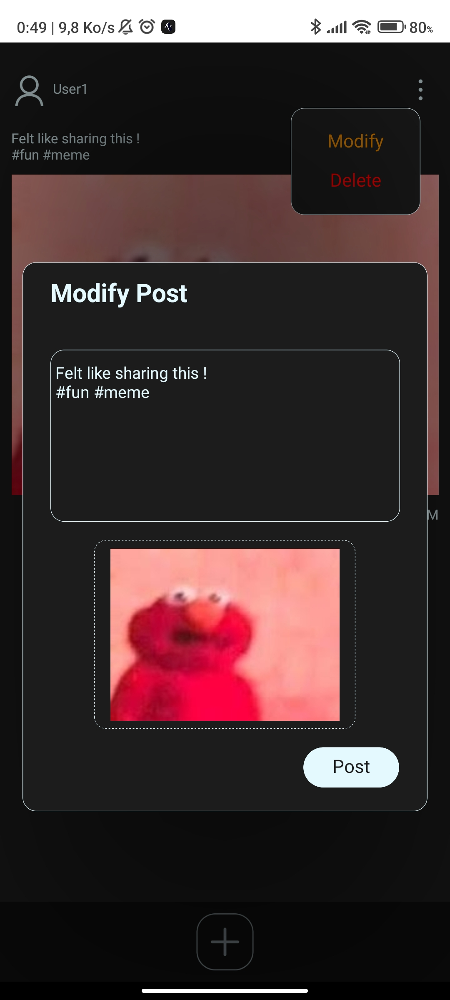

# Author

## Ruben Dunesme

## Description

This project is a small project developed with React Native. It's an app called Newzed where you can post news. (Not connected to the internet)

## Get started

1. Install dependencies

   ```bash
   npm install
   ```

2. Start the app

   ```bash
    npx expo start
   ```

## ScreenShots








